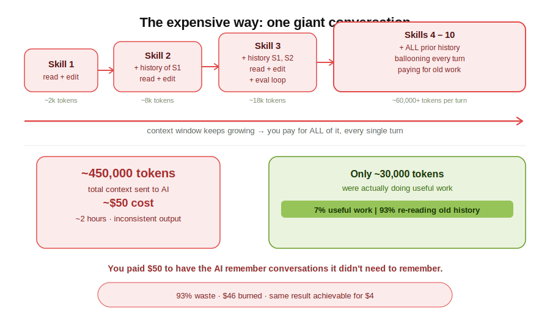
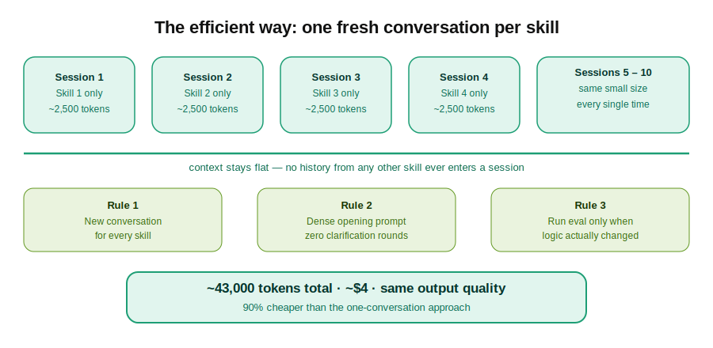
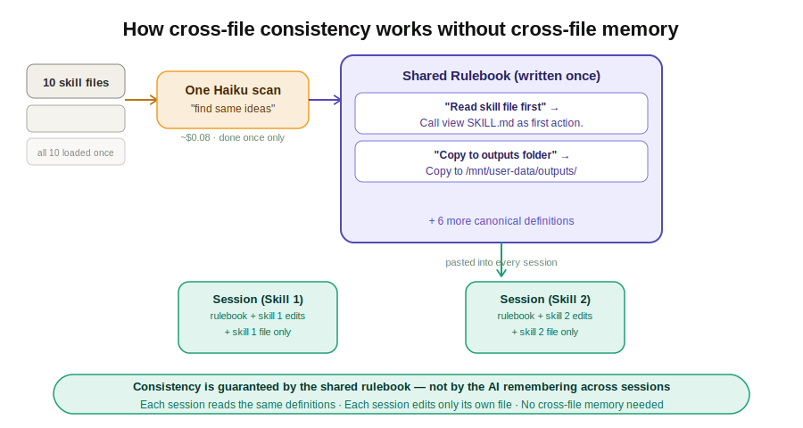
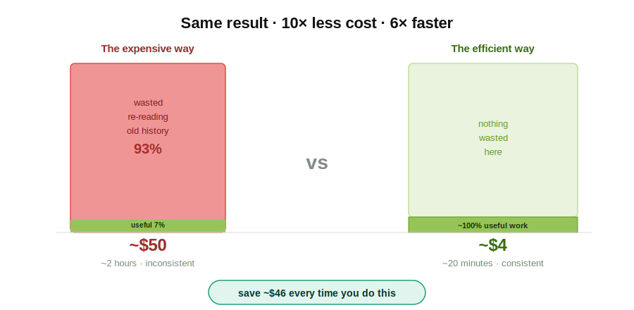

It was a Tuesday afternoon and I had what felt like a perfectly reasonable task.

I'd built up ten instruction files — "skills" — for Claude, Anthropic's AI assistant. Over months they'd gotten messy. Each one had grown independently, so they contradicted each other, used different formatting, repeated the same ideas in different words. Classic documentation drift. I figured I'd spend an hour getting Claude to tidy them all up: make them consistent, strip the redundancy, clean up the language.

Two hours later, I'd hit my usage limit on Claude.ai. My bill showed nearly $50. The files were... marginally better. And I had absolutely no idea what had gone wrong.

*This is that story, and what I now do instead.*

## The plan that seemed totally sensible

My approach was this: open one conversation in Claude.ai, upload all ten files, and say something like "refactor these for consistency and remove any redundancy."

I mean — that's the point of Claude, right? You describe what you want, it does it. Simple.

Except Claude immediately came back with questions. Four of them. What did I mean by consistent? Should it preserve all the examples? Were there files it shouldn't touch? What should it prioritize?

Fine. I answered them. We got started.

By file three, I noticed something odd. The responses were getting slower. The conversation was getting long. Claude seemed to be... re-reading things it had already read. I'd ask it to tweak something in file seven, and it would summarize what it remembered about files one through six before getting to the point.

*I assumed this was just how it worked. I kept going.*

## The moment I realized something was very wrong

Around file eight, I got a notification. I'd burned through my usage allowance.

I checked my dashboard. Nearly $50 in two hours. For editing text files.

I sat with that number for a moment. Fifty dollars. I could have hired a junior editor for an afternoon. I could have done it myself in three hours with a cup of coffee and a text editor. Instead I'd handed it to Claude, assumed it would be fast and cheap, and watched my budget quietly evaporate in the background while I answered emails.

*What had I actually paid for?*

## What was actually happening under the hood

When I dug into it afterward, the explanation was almost comically simple — and I'd had no reason to know it in advance.

Claude — like all large language models — works on a "context window." Everything that's happened in the conversation so far gets sent to the model on every single turn. Every message. Every file. Every response. All of it, every time.

So when I was working on file eight, Claude wasn't just processing file eight. It was also carrying files one through seven, plus every message we'd exchanged, plus every response it had generated. By that point I was sending something like 60,000 tokens per turn to Claude Sonnet — and paying for every single one.

The actual useful work — the edits to file eight — was maybe 2,000 tokens. I was paying for 58,000 tokens of baggage I didn't need.

**93% of what I paid for was re-reading old conversations. I had been, quite literally, paying Claude to remember things it didn't need to remember.**

## The fix is almost embarrassingly simple

Once you understand the problem, the solution is obvious in retrospect.

Don't put all ten files in one Claude conversation. Use ten separate conversations — one per file. Each conversation stays small. The context never grows. You pay for the work, not the history.

But there's a catch: if the whole point is to make the files consistent with each other, how do you do that across separate Claude sessions that share no memory?

This is where it gets interesting. The answer is: you do the "figuring out what's consistent" work separately, cheaply, up front — and then hand each conversation a pre-written rulebook.

*Instead of asking Claude to discover consistency as it goes, you define consistency before it starts. Then each session just executes against the rules — it doesn't need to know anything about the other files.*

## The smarter workflow (the one I use now)

Here's how I'd approach the same task today. It takes a bit more planning up front, but the total cost is around $4 instead of $50, and the output is actually better.

**Step 1: spend five minutes on intent, not files.** Before touching a single file, open one cheap conversation with Claude Haiku — Anthropic's fastest, most economical model — and write out what you actually mean by "consistent." What's the tone? What's the structure? Which patterns repeat? Write it as a spec — a one-page document you'll paste into every subsequent conversation. This costs almost nothing.

**Step 2: scan for repeated ideas, once.** Load all ten files into one Claude Haiku session and ask only: "what ideas appear across multiple files, expressed differently?" Not "fix them" — just "find them." The output is a map of what's repeated. This is the only moment all ten files exist in the same conversation.

**Step 3: write canonical definitions.** For each repeated idea, write one authoritative version — the exact wording you want everywhere. This is your rulebook, and you control it. Claude doesn't decide what's canonical; you do.

**Step 4: edit each file in its own fresh Claude conversation.** Each session gets: the spec, the rulebook, the specific list of changes for that one file, and that file's content. Nothing else. One or two turns with Claude Sonnet. Done.

> The insight is that cross-file consistency doesn't require cross-file memory. It just requires a shared definition, written once and pasted everywhere. Claude doesn't need to remember what file three said when editing file seven — it just needs the rulebook.

## What I wish I'd known

None of this is obvious from the outside. When you're just using Claude, the pricing feels magical and arbitrary — sometimes something costs nothing, sometimes it costs a lot, and you can't tell why.

The mental model that actually helps: think of Claude's context window like a taxi meter. Every token in the conversation is a passenger in the cab, and you pay for all of them every time the cab moves. Stuffing ten files and an hour of chat history into one cab and then wondering why the fare is high — that's on you, not the driver.

The other thing I wish I'd known: Claude isn't lazy when it asks clarifying questions. It's telling you that your prompt was underspecified. Every clarification question is a wasted round trip. The single most effective habit I've developed is writing my opening prompt as if Claude has no ability to ask follow-ups — all the intent, constraints, and success criteria in one dense paragraph.

*It feels like more work up front. It's dramatically less work in total.*

## The $46 lesson

I've since run the same ten-file task using the smarter workflow. Total cost: $3.80. Time: about twenty minutes of actual attention, spread across the sessions. Output quality: genuinely better — more consistent, tighter, no weird compromises from Claude trying to hold ten files in mind simultaneously.

The $50 version was a lesson I didn't know I needed. Claude is genuinely powerful, but it rewards people who understand how it works — and quietly penalizes people who treat it like magic. I was firmly in the second camp.

The good news is the gap between "treats it like magic" and "understands how it works" is smaller than it looks. It's basically one mental model — the taxi meter — and one habit: write your whole intent upfront, then start a fresh Claude conversation for each distinct task.

*That's it. That's the $50 lesson.*

---

*If this saved you from making the same mistake, share it with someone who uses Claude daily. They probably don't know about the taxi meter either.*

#Claude #Anthropic #Productivity #LessonsLearned #AITools #PromptEngineering
